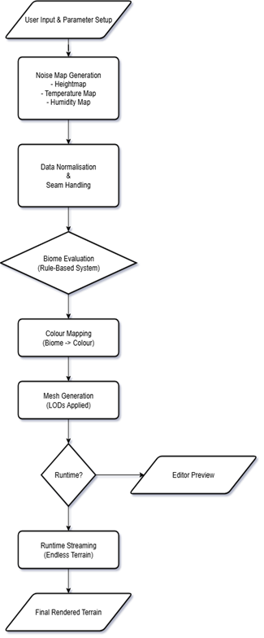
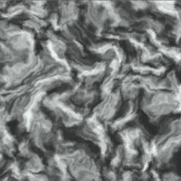
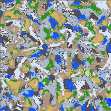
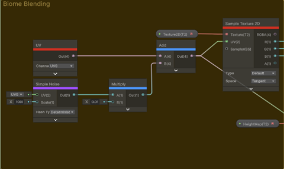

# Procedural Terrain & Biome Generation System

A modular procedural terrain generation system developed as part of my MSc dissertation in Unity. The project explores biome-driven landscape generation through rule-based evaluation, domain-warped noise, shader-based biome blending, and runtime chunk streaming.

The system was designed around flexibility and designer control while supporting large-scale terrain generation at runtime.

---

## Features

- Rule-based biome evaluation using environmental parameters
- Domain-warped noise to reduce visible terrain repetition
- Infinite terrain generation with chunk streaming
- Seam-aware generation strategies
- GPU-based biome blending using Shader Graph
- Runtime optimisation for asynchronous generation

---

## Technologies

- Unity
- C#
- Shader Graph
- Procedural Generation
- Noise Functions
- Runtime Terrain Streaming

---

## Technical Overview

The terrain pipeline combines layered procedural noise with environmental evaluation systems to generate biome-driven landscapes.

Terrain generation follows several stages:

1. Height generation through layered noise
2. Domain warping for large-scale variation
3. Environmental parameter evaluation
4. Rule-based biome assignment
5. Shader-driven biome blending
6. Runtime chunk streaming

The project focuses on balancing procedural diversity, runtime performance, and designer control.

---

## Gallery

### Generation Pipeline

### Domain-Warped Noise

### Biome Classification

### Shader-Based Biome Blending

---

## Portfolio

Portfolio project page:

[Portfolio Link Coming Soon]

---

## Status

Completed as part of MSc dissertation work.

Future extensions include:

- River generation
- Biome-specific asset placement
- Volumetric terrain generation
- JSON preset export/import
